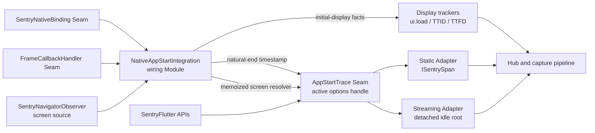

# Standalone and Extended App Start — Technical Design

**Status:** Implemented

**Product specification:** [standalone-app-start-spec.md](standalone-app-start-spec.md)

## Summary

Flutter owns one standalone `App Start` root on Android and iOS. The normal
initial `ui.load` remains an independent sibling root for TTID and TTFD.

One wiring Module observes native timing and Flutter's first rendered frame,
then sends those facts to two independent branches:

- the display trackers own `ui.load`, TTID, and TTFD;
- the active `AppStartTrace` owns standalone app-start and extension policy.

`AppStartTrace` receives a natural-end timestamp. It does not import
Flutter frame APIs and does not depend on display tracking.

## Public Interface

Add this experimental option to `SentryFlutterOptions`:

```dart
/// Whether standalone app-start tracing is enabled.
///
/// Requires tracing to be enabled. Defaults to `false`.
@experimental
bool enableStandaloneAppStartTracing = false;
```

Add these methods to `SentryFlutter`:

```dart
static void extendAppStart();

static ISentrySpan? getExtendedAppStartSpan();

static SentrySpanV2? getExtendedAppStartSpanV2();

static void finishExtendedAppStart();
```

The Interface has these invariants:

- `getExtendedAppStartSpan()` works only with the static trace lifecycle.
- `getExtendedAppStartSpanV2()` works only with the streaming trace lifecycle.
- Calling the getter for the inactive lifecycle returns `null`.
- Both getters return the actual `Extended App Start` child, never the root.
- A getter returns `null` after its extension wrapper has finished.
- `finishExtendedAppStart()` requests wrapper completion and returns
  immediately.
- Direct `ISentrySpan.finish()` and `SentrySpanV2.end()` have the same
  app-start telemetry effect as `finishExtendedAppStart()`.
- The extension wrapper's recorded finish timestamp defines the explicit
  extension end. Descendants that finish later delay root capture but do not
  move the wrapper end or the app-start measurement.
- No extension API promises to wait for root finalization or capture.
- Disabled, unsupported, late, duplicate, and already-finished operations are
  no-ops rather than errors.

No common public span type is introduced. `ISentrySpan` and `SentrySpanV2` are
already public through `package:sentry`.

## Trace structure

```text
App Start                         app.start
├── native platform phase
├── native platform phase
├── plugin registration
├── Sentry setup
├── first frame render            open until natural end
└── Extended App Start            app.start.extended, optional
    ├── user initialization span
    └── user initialization span
```

All SDK-owned breakdown spans and the optional extension wrapper are direct
children of the root. Only user-created initialization spans nest beneath the
extension wrapper. A nested span may outlive an explicitly finished extension
wrapper; the root still waits to capture it, but its later end does not extend
the app-start measurement. There is no cold/warm grouping span.

Add internal named constants instead of inline strings for:

- `SentrySpanOperations.appStart` → `app.start`;
- `SentrySpanOperations.appStartExtended` → `app.start.extended`;
- `SentryTraceOrigins.autoAppStart` → `auto.app.start`;
- `SemanticAttributesConstants.appVitalsStartScreen` →
  `app.vitals.start.screen`.

The standalone app-start feature directory also owns single definitions of the
root and extension names, the three-second idle timeout, and the 30-second
final timeout. A pure helper computes semantic duration from process start,
natural end, and the optional extension-wrapper end. No shared Adapter base
class is introduced; lifecycle mechanics remain in the two concrete Adapters.

## Modules

### `NativeAppStartIntegration` — modified wiring Module

`NativeAppStartIntegration` remains the single wiring Module for native app
start. It does not create app-start or display spans itself.

Its Interface is `Integration.call()` and `Integration.close()`.

When the standalone flag is off, it preserves the current attached app-start
behavior through the existing static and streaming handlers.

When the standalone flag is on, `call()`:

1. Gates on tracing and Android/iOS support.
2. Fetches native timing once through `SentryNativeBinding` before
   `appRunner` runs. Fetch or parsing failures are logged through the Flutter
   package's `internalLogger` and treated as missing native timing.
3. Parses intrinsic native timing without requiring the first-frame timestamp.
4. Prepares initial display tracking even when native timing is missing or
   invalid or fetching/parsing failed.
5. Switches on `traceLifecycle` and calls the selected concrete Adapter's
   nullable `tryCreate()` method.
6. Publishes the selected `AppStartTrace` only when native root timing is
   valid and the app-start root is sampled.
7. Registers one first-frame timings callback.

Installation is one-shot. A `_closed` guard and the stored options identity
prevent duplicate or concurrent `call()` invocations from publishing multiple
lifecycles or frame callbacks. Because native timing is awaited, `call()`
rechecks `_closed` immediately after that await and again before publishing the
callback. `close()` is idempotent and clears `_options` as well as every owned
resource.

When the option is configured, the integration records
`SentryFeatures.standaloneAppStartTracing` through
`options.sdk.addFeature(...)`. It continues to record the integration through
`options.sdk.addIntegration(...)`. The named feature constant lives in core;
neither analytics value is inlined.

The integration owns a memoized initial-screen-name resolver backed by
`SentryNavigatorObserver.currentRouteName`. It resolves only when natural end
or the hard deadline is recorded: a non-empty observed route name wins,
otherwise it returns the existing `root /` foreground fallback. The same
non-null `String Function()` is passed to the selected `AppStartTrace` Adapter;
this lets an Adapter retain the required screen on its deadline path without
importing navigation APIs. The first-frame callback converts Flutter's
raster-finish wall time into a `DateTime`, calls the resolver once to freeze
the initial screen, and fans out only the timestamp:

```text
first-frame timestamp ──> display tracker
first-frame timestamp ──> AppStartTrace.recordNaturalEnd()
```

This fan-out is the only place where frame detection, display tracing, and
app-start meet. Neither downstream branch calls the other.

Screen freezing, display recording, and app-start natural-end recording are
fault-isolated. Each branch logs its own failure and every sibling gets an
opportunity to run. In automated test mode, a captured failure may be rethrown
only after all branches ran. The memoized screen resolver itself is
non-throwing and falls back to `root /`.

The timings callback is exactly-once even if Flutter queues the same callback
more than once. At callback entry it verifies that it is still the callback
stored in `_firstFrameCallback`, clears that field, and unregisters itself
before doing any work. A queued invocation after the first call or after
`close()` is therefore a no-op without another boolean guard.

`close()` removes the registered callback, closes the trace instance it
created if it is still active, clears that exact instance from
`SentryFlutterOptions`, and releases all Adapter hooks and timers. Normal root
completion clears the active trace by identity without calling `close()`;
`close()` is the shutdown/abandon path, not the successful-completion path.
Callback removal, Adapter shutdown, and identity clearing use nested
`try`/`finally` cleanup so one failure cannot skip the remaining steps.

The Adapter completion callback records completion even if it runs before the
local trace is installed. An already-completed Adapter is never published
to `SentryFlutterOptions`. Unexpected Adapter-creation failures are logged only
after the Adapter has rolled back its own acquisition; they omit `app.start`
without suppressing the independent first-frame/display installation.

Test Seam:

- existing `FrameCallbackHandler` with its fake;
- existing `SentryNativeBinding` with a mock implementation;
- fake display trackers;
- controlled `Hub`, clock, and lifecycle registry dependencies exercised
  through the real static and streaming Adapters.

### `AppStartData` — new/modified value Module

`AppStartData` contains only intrinsic startup facts:

- process-start timestamp;
- cold/warm type;
- plugin-registration timestamp;
- Sentry setup timestamp;
- valid native phase intervals.

It does not contain a first-frame or final end timestamp.

Parsing is a pure function. The native payload and Sentry setup timestamp are
explicit inputs; the parser does not read global state. Missing or structurally
invalid root timing returns `null`. A malformed optional native phase is
discarded individually without discarding otherwise valid root timing.

The native timing Seam must provide an in-progress timing snapshot before the
first Flutter frame. If a platform Adapter currently exposes timing only after
the first frame, that Adapter must be deepened to expose start-only timing;
root creation must not be delayed until the first frame because extension APIs
must work during startup.

The legacy flag-off path keeps its existing end-to-end 60-second duration
filter. The standalone path validates staleness at snapshot time: process start
must not be in the future or more than 60 seconds older than the snapshot.
After a streaming root exists, spans cannot be retracted, so standalone mode
does not perform a second invalidation at first frame. Its 30-second hard
deadline governs missing or excessively delayed natural completion from that
point onward. An extension may intentionally make the final duration longer
than the legacy 60-second filter.

Pure parser tests cover missing fields, invalid ordering, malformed phases,
sorting, cold/warm mapping, and timestamp conversion.

### Display trackers — modified existing Modules

`TimeToDisplayTracker` and `TimeToDisplayTrackerV2` gain equivalent internal
operations, conceptually:

```dart
void prepareInitialDisplay(DateTime startTimestamp);
void recordInitialDisplay(DateTime endTimestamp);
```

They exclusively own:

- the initial `ui.load` root;
- TTID;
- TTFD.

In standalone mode they never attach app-start measurements or app-start
breakdown spans. Valid native timing may supply the display start timestamp;
otherwise they use the existing fallback start. Missing or invalid native
timing therefore omits only `app.start` and never suppresses `ui.load`.

The static and streaming display trackers remain separate because their
underlying trace APIs differ. No new common public display type is needed.

The static `TimeToDisplayTracker` receives an injected `Hub` and creates and
retains its initial `ui.load` transaction in `prepareInitialDisplay()`, with
the existing scope-binding behavior. `recordInitialDisplay()` passes that
retained transaction through its existing TTID/TTFD tracking. This keeps
static display-root creation out of the wiring Integration and app-start
Adapters. `TimeToDisplayTrackerV2` continues to own the equivalent streaming
idle root.

### `AppStartTrace` — internal Seam and active trace handle

`AppStartTrace` hides lifecycle-native trace mechanics. It has two production
Adapters and one fake:

- `StaticAppStartTrace`;
- `StreamingAppStartTrace`;
- `FakeAppStartTrace` in tests.

Conceptually it supports:

```dart
bool tryCreateExtension(DateTime startTimestamp);
ISentrySpan? get activeStaticExtension;
SentrySpanV2? get activeStreamingExtension;
void finishExtension();
void recordNaturalEnd(DateTime endTimestamp);
void close();
```

The wiring Integration is the production composition point. It switches
directly on `traceLifecycle` and calls `StaticAppStartTrace.tryCreate()` or
`StreamingAppStartTrace.tryCreate()`. Each nullable `tryCreate()` acquires and
validates all mandatory recording state and cleans up anything acquired before
a later failure. A private Adapter may be constructed once its root and barrier
are valid so it can own rollback, but it cannot escape until breakdown creation,
hook registration, and deadline scheduling have succeeded. `null` is an
expected unsampled, no-op, capacity, barrier, or deadline-scheduling outcome;
it is not an exception and no partially valid Adapter escapes. Unexpected
exceptions are logged and rethrown only after all acquired resources have been
rolled back.

Neither Adapter creation method accepts `SentryFlutterOptions`; clock and
lifecycle facilities are reached through `hub.options`. There is no injected
creation function, stored builder, wrapper, or factory class. Public API tests
use a fake `AppStartTrace`; integration tests use the real concrete Adapters so
they cover the production lifecycle switch and wiring.

A `null` trace skips only active-trace publication. It must not return from the
Integration: first-frame processing is still installed so the independent
`ui.load` branch completes normally.

`tryCreateExtension()` reports whether a real recording child was created; the
Adapter retains that child in its lifecycle-native type and enforces
first-successful-extension-wins by retaining the first recording child even
after it ends. Each Adapter returns its own active typed child and `null` from
the other lifecycle's query. `SentryFlutter` delegates directly to the active
trace stored on `SentryFlutterOptions` and supplies `options.clock()` to
`tryCreateExtension()`.
`recordNaturalEnd()` records the first timestamp and finishes the mandatory
barrier exactly once. Static fire-and-forget `finish()` operations attach error
handlers that log and consume asynchronous failures.

Each production Adapter owns:

- creation of the detached `App Start` root;
- lifecycle-native root and child attributes;
- direct phase children;
- the open first-frame breakdown child;
- the raw extension child;
- configuring lifecycle-native idle/descendant waiting and hard-deadline
  mechanics;
- root processing and capture cleanup.

Adapter construction requires an `onCompleted` callback and the memoized
`String Function()` initial-screen-name resolver. An Adapter invokes
`onCompleted` exactly once, after its final root-enrichment attempt and after it
can no longer accept an extension. Each trace root owns its idle and final
timers; the Adapter owns successful cleanup of its hooks. The callback only
makes the trace inactive and detaches its reference by identity. Successful
detachment never calls `AppStartTrace.close()` and therefore cannot abandon a
root still moving through the capture pipeline. Static invokes the callback
from transaction finalization; streaming invokes it at the end of the root's
`OnProcessSpan` callback, before normal capture continues.

Both production Adapters create the mandatory first-frame barrier at
`AppStartData.sentrySetupTimestamp`, before any optional breakdown child. This
preserves the existing first-frame phase taxonomy; the root itself remains
backdated to process start. Adapter setup succeeds only when that barrier is an
actual recording span. If a span limit, filtering, or another condition
returns a no-op barrier, the Adapter cancels or abandons the root without
capture and no active trace is published. This prevents the three-second
idle finish from winning before the first frame.

This is a real Seam because static and streaming are materially different
Adapters and policy tests use a fake. No public abstraction crosses it.

## Static Adapter

`StaticAppStartTrace` creates an unbound static transaction with:

```text
name: App Start
operation: app.start
origin: auto.app.start
waitForChildren: true
bindToScope: false
trimEnd: true
autoFinishAfter: 3 seconds
```

These are the root's existing transaction-construction options. There is
deliberately no `finalTimeout` constructor option or default for
`SentryTracer`. After the recording root and mandatory first-frame barrier
have both been created successfully, `StaticAppStartTrace` separately opts
this root into the app-start safety deadline by calling the internal
`Hub.tryScheduleFinalTimeout()` operation. The absolute deadline is the
wall-clock time at which the root was created plus 30 seconds. It is not
calculated from the root span's `startTimestamp`, which is backdated to process
start.

The Flutter Adapter stores the root and first-frame barrier only as
`ISentrySpan`; it never imports or checks the core-only `SentryTracer` or
`SentrySpan` implementations. The Adapter is installed only when root and
barrier expose sampled recording decisions and the Hub accepts the final
timeout. An unsampled, no-op, or unsupported root does not create an active
the active `AppStartTrace`.

The open first-frame child prevents root completion before natural end.
`SentryTracer` already tracks every descendant created through the returned
`ISentrySpan`, retries root finishing after child completion, and trims the
root end to the latest child end. No second descendant registry is added.

`StaticAppStartTrace.tryCreateExtension()` creates the actual direct child
returned publicly:

```dart
root.startChild(
  SentrySpanOperations.appStartExtended,
  description: 'Extended App Start',
  startTimestamp: now,
);
```

Only a child with a sampled recording decision counts as a successful
extension. A `NoOpSentrySpan`, for example after filtering or span-limit
rejection, is not stored as the one-shot sentinel. The getter returns the child
only while its `endTimestamp` is absent and it is not finished.
`finishExtendedAppStart()` invokes its `finish()` without awaiting it. Direct
finish and the helper therefore establish the same explicit extension end.

No extension-finish lifecycle callback or duplicate `_extensionEnd` field is
needed. During final enrichment the Adapter reads the retained extension's
`endTimestamp` directly. `SentrySpan.finish()` assigns that timestamp before
awaiting collectors or dispatching lifecycle callbacks, so direct finish is
observable without another global hook.

The `SentryTracer` owns one 30-second final timeout beginning when the root is
created. Extension creation does not move it. The tracer stores the absolute
deadline timestamp so a delayed `Timer` callback still uses the intended
deadline.

An ordinary `SentryTracer.finish()` request does not seal the tracer. In
particular, the three-second `autoFinishAfter` request may wait on the
first-frame barrier while a later extension and its initialization descendants
are still created legitimately.

`Hub` gains narrow internal operations for arming a final timeout and
abandoning a static transaction. `StaticAppStartTrace` records the root
creation time and asks the Hub to arm the timeout after confirming that root
and first-frame barrier creation succeeded. The Hub keeps the concrete
`SentryTracer` downcast inside core. Adapter assignment and optional breakdown
creation happen before the final deadline is armed, removing any `late`
`onFinish` target. No existing transaction creation Interface changes, and
transactions such as `ui.load` retain their current unbounded child-waiting
behavior because they never arm a final timeout.

```dart
@internal
bool tryScheduleFinalTimeout(
  ISentrySpan span,
  DateTime deadlineTimestamp,
);

@internal
void abandonSpan(ISentrySpan span);
```

`tryScheduleFinalTimeout()` returns `true` only when this call installs the
first deadline on a sampled, open `SentryTracer` supported by that Hub. It
returns `false` for an unsupported, unsampled, already-scheduled, finalizing,
abandoned, or finished tracer. `HubAdapter` forwards both operations to the
current Hub; `NoOpHub` returns `false` or no-ops. Flutter therefore depends only
on `Hub` and public span Interfaces, without importing another package's `src`
implementation.

The operation's contract is:

- the first call stores the absolute deadline; another call cannot replace or
  extend it;
- it schedules only the remaining interval between the tracer's current clock
  and that deadline, running the deadline path immediately if the timestamp is
  already due;
- forced completion uses the stored deadline as the root and unfinished-child
  end timestamp, even when the Dart `Timer` callback runs late;
- normal completed capture and abandonment cancel the timer;
- it does not change `autoFinishAfter`, `waitForChildren`, or the behavior of a
  tracer for which the operation is never called.

`SentryTracerFinishStatus` and a separate sealed boolean are replaced by one
authoritative lifecycle with phases equivalent to `open`, `finishRequested`,
`finalizing`, `abandoned`, and `finished`. `finalizing` carries whether the
reason is ordinary or deadline and one cached `Future<void>`. The phase is
installed before any awaited work, so concurrent ordinary/deadline finish
requests join one operation and `onFinish` plus capture execute at most once.
An ordinary finish request may remain in `finishRequested` while children are
open. The deadline may upgrade either that request or an in-flight ordinary
finalization to deadline mode without starting a second operation; the shared
continuation rechecks its mode after awaited work and applies the forced
status/end before capture. Abandonment is terminal and every continuation
rechecks it after awaited hooks and before capture.

When the final timeout expires, the tracer enters deadline finalization,
records the forced root status and absolute end timestamp, takes a stable child
snapshot, and terminally resolves that snapshot before normal capture. Child
creation is accepted only while the phase is `open` or `finishRequested`. This
keeps child-registry invariants inside the tracer and prevents a retained
extension from adding a descendant during the drain.

On deadline, the static path:

1. The tracer seals itself before inspecting children, sets
   `deadlineExceeded` on the root and every unfinished child, and finishes each
   valid interval at the stored timestamp.
2. A child with a malformed future start is also made terminal with
   `deadlineExceeded`, but is discarded from the payload rather than emitting
   an end-before-start interval.
3. Completed child statuses remain unchanged.
4. The tracer follows its normal `onFinish` and Hub capture path exactly once.
5. The Adapter's `onFinish` callback derives deadline completion from the
   core-owned root status, resolves the required memoized screen name, and
   performs final enrichment.

An `onFinish` callback adds the lifecycle-native cold/warm measurement only
when a first frame was observed and the final timeout did not win. It also adds
the type and required frozen initial-screen metadata. The Adapter derives the
measurement end from the later of the recorded natural end and the extension
wrapper's recorded end, when present. It deliberately does not use the root's
trimmed end: a descendant that outlives the wrapper delays capture but does not
implicitly extend app start. It emits `app_start_cold` or `app_start_warm` and
the lifecycle-native type and
`app.vitals.start.screen` data. The normal Hub path captures the transaction
exactly once. After the enrichment attempt, the Adapter marks itself complete,
unregisters no extension-specific hook, and invokes `onCompleted`. Public APIs become
inactive before capture continues, which is valid because the public Interface
has no capture-completion guarantee. This success path never calls `close()`
or `abandon()`.
Enrichment and completion notification each catch and log their own failures;
optional metadata failure cannot escape `onFinish` and strand the transaction
before capture, including in automated-test mode.

The Hub's `abandonSpan()` delegates to a tracer-owned abandon operation for SDK
shutdown. It
cancels both the existing auto-finish timer and the app-start-only timer armed
by `tryScheduleFinalTimeout()`, enters the authoritative `abandoned` phase,
disables later
child-triggered finish retries, and does not capture. An ordinary finish
request that is still waiting for children does not cancel the scheduled final
timeout; only completed capture or abandonment does. The abandoned state is
checked before and after any awaited finalization hook so a finish already in
progress cannot resume into capture. Abandonment also disposes an attached
profiler exactly once; profiler cleanup must not depend only on the normal
`finish()` path's `finally`. `StaticAppStartTrace.close()` asks the Hub to
abandon an unfinished root.
Close-before-first-frame and close-with-open-extension are covered by tests.

## Streaming Adapter

`StreamingAppStartTrace` uses `IdleRecordingSentrySpanV2` because it already
provides descendant tracking, idle completion, trimming, and a final timeout.
It creates the root through the internal Hub Interface:

```dart
hub.startIdleSpan(
  'App Start',
  setAsActive: false,
  idleTimeout: const Duration(seconds: 3),
  finalTimeout: const Duration(seconds: 30),
  trimIdleSpanEndTimestamp: true,
  // app-start attributes and timestamps
);
```

The root attributes set `sentry.op=app.start`,
`sentry.origin=auto.app.start`, and the known cold/warm type at creation. The
Adapter supplies each direct phase, first-frame, and extension child's own
operation and origin attributes when it creates that child.

### Detached idle-root behavior

Add this default-preserving internal parameter to `Hub.startIdleSpan`:

```dart
bool setAsActive = true,
```

`setAsActive` is preferred over `bindToScope`: the current idle span is stored
in `Hub._idleSpan` and used as the fallback from `Hub.getActiveSpan()`; it is
not stored in `Scope`.

When `setAsActive` is `true`, existing behavior remains unchanged:

- reject creation when another Hub-active idle span exists;
- assign the new span to `Hub._idleSpan`;
- use it as the implicit parent outside a zone-active span.

When `setAsActive` is `false`:

- do not apply the one-active-idle guard;
- do not assign the span to `Hub._idleSpan`;
- do not return it from `Hub.getActiveSpan()`;
- still sample it as a root;
- still dispatch lifecycle callbacks;
- still track descendants whose explicit parent chain reaches that root;
- still capture it through the normal Hub pipeline.

Consequently, the Hub-active `ui.load` retains implicit parenting while the
detached `App Start` receives only explicitly parented children:

```text
Hub active span
└── ui.load

Detached idle root
└── App Start
    └── Extended App Start
        └── explicitly parented user spans
```

### Other narrow idle-span changes

The existing idle-span Deep module gains these capabilities and invariants:

- any `finalTimeout` marks the root and every still-active descendant as V2
  `error` with `sentry.status.message=deadline_exceeded`, then terminally drains
  that descendant snapshot;
- an internal cancellation path that removes callbacks and timers and
  terminally cancels the root plus every active descendant without dispatching
  their `onSpanEnd` capture callbacks. A retained descendant is already ended,
  so a later `end()` is a no-op rather than an orphaned capture. Descendants
  processed before cancellation cannot be recalled.

The idle root records one absolute final-deadline timestamp at construction.
The final-timeout callback ends the root and active descendants at that stored
timestamp rather than the potentially delayed `Timer` callback time.
Extension creation does not move the deadline. Completed descendants have
already left the active map and keep their statuses. Normal idle-timeout and
manual-finish behavior remain unchanged. A malformed future-dated descendant
is marked terminal with the deadline status and discarded from processing, so
it neither blocks the root nor captures later as an orphan.

This deliberately corrects existing V2 final-timeout telemetry: an active
descendant previously ended as `ok` even though the idle root reported
`deadline_exceeded`. There is no app-start-specific switch or opt-out because
the idle-span Deep module already owns the finish reason and descendant drain.
The observable correction is documented and regression-tested across every
existing idle-root consumer rather than hidden behind a permanent policy that
preserves contradictory status.

`setAsActive` is part of the internal `Hub` Interface. Its signature and
forwarding must be added consistently to `HubAdapter`, `NoOpHub`, and test Hub
implementations; otherwise integrations, which receive a `HubAdapter`, cannot
create the detached root.

`RecordingSentrySpanV2` gains the internal no-capture terminal primitive used
by that cascade. `Hub._createSpan` rejects explicit child creation when the
recording parent's segment root is ended or cancelled. It does not reject a
child solely because its immediate parent ended: existing asynchronous
descendants may legitimately outlive that parent, while a terminal segment
root can no longer own another captured span.

### Streaming processing

The returned `SentrySpanV2` is the actual extension child. Direct `end()`
changes `isEnded` synchronously, so the public getter immediately returns
`null`. User initialization spans use `Sentry.startSpan` or
`Sentry.startInactiveSpan` with the extension as `parentSpan`.

No extension-end lifecycle callback or duplicate `_extensionEnd` field is
needed. During root processing the Adapter reads the retained extension's
`endTimestamp` directly. `RecordingSentrySpanV2.end()` assigns that timestamp
before dispatching lifecycle callbacks, so direct `end()` and
`finishExtendedAppStart()` establish the same explicit extension end.

The Adapter is installed only when root creation returns an actual recording
idle span; a `NoOpSentrySpanV2` does not create an active lifecycle. Similarly,
an extension attempt counts as the first successful extension and stores its
sentinel only when child creation returns an actual recording span. A filtered
or no-op child does not consume first-successful-extension-wins state.

The open first-frame child is the natural-end barrier. Once it ends, existing
idle tracking waits for the extension and all user descendants. Root timestamp
trimming may select a later descendant end for the captured segment, but that
capture timestamp does not define the app-start measurement.

A single `OnProcessSpan` callback, filtered by root identity, adds:

- `app.vitals.start.value`;
- the cold/warm compatibility value;
- `app.vitals.start.type`;
- `app.vitals.start.screen`;
- segment name `App Start`.

Duration values are omitted when natural end was never observed or the root
has the lifecycle-native deadline state: V2 `error` plus
`sentry.status.message=deadline_exceeded`. This state is established by core
before `OnProcessSpan` callbacks run; the Adapter owns no parallel deadline
boolean. Otherwise the Adapter computes values from the later of the recorded
natural end and the extension wrapper's recorded end, when
present; later descendant completion is ignored for the vital. Type and the
frozen initial screen remain. At the end of this root-specific callback, the
Adapter marks itself complete, unregisters its processing hook, invokes
`onCompleted`, and lets the normal capture pipeline continue.
The Adapter never calls capture manually; ending the idle root follows the
existing Hub capture path.
Enrichment, hook removal, and completion notification use nested
`try`/`finally` guards. Each failure is logged, and optional enrichment cannot
throw out of `OnProcessSpan` and suppress capture in automated-test mode.

## Sampling

No new sampling Module or Interface is needed. Both existing Hub root-creation
paths already:

- read the propagation context's trace ID;
- initialize or reuse its single `sampleRand`;
- evaluate the normal root `tracesSampler` independently; and
- call `PropagationContext.applySamplingDecision()` only to establish the
  first outgoing propagation decision.

`PropagationContext.sampled` is not read as input when a local root is sampled.
Creating `ui.load` first therefore cannot suppress the
`app.start` sampler call, or vice versa. The two roots automatically share the
trace ID and sample-random value while retaining separate sampling contexts and
sampler evaluations.

This feature does not change lifecycle-wide incoming trace or inherited
sampling behavior. In particular, streaming root sampling currently documents
incoming propagation decisions as unsupported. If that capability is added,
it belongs in the core Hub sampling policy for every streaming root rather than
in a Flutter app-start-specific context object. No app-start-specific
sample-rate option is introduced.

An unsampled standalone root does not publish an active `AppStartTrace`;
the extension APIs therefore no-op and their getters return `null`.

## Screen metadata

The wiring Integration supplies one memoized non-null screen-name resolver to
both the first-frame fan-out and the selected Adapter. On its first call it
returns a non-empty `SentryNavigatorObserver.currentRouteName` when available;
otherwise it returns `root /`, matching the current foreground `ui.load`
fallback. That value is then frozen, so a later route cannot replace the
initial screen.

Natural end calls the resolver once only to freeze the name, then passes just
the timestamp to the active `AppStartTrace`. During enrichment the Adapter reads
the same memoized resolver. If no first frame arrives, the Adapter's deadline
path resolves it before processing. Every foreground standalone event
therefore contains `app.vitals.start.screen`; a missing field remains reserved
for a start with no screen. Resolution never delays capture.

## Native ownership and future platforms

Flutter remains the sole owner of the standalone signal:

- Android native standalone app-start emission remains disabled;
- Cocoa hybrid mode supplies native timing without attaching it elsewhere;
- Dart does not delegate extension calls to Android's native extension API.

Future platforms implement the existing native timing Seam and return
`AppStartData`. Adding a platform changes platform gating and its native
Adapter, not the public Dart Interface or lifecycle policy.

## Successful completion

The natural-end callback finishes the first-frame breakdown child. The root
then follows its lifecycle-native idle behavior:

1. It remains open while the extension wrapper or any descendant is open.
2. Once no descendants remain, the idle timer may request root completion.
3. The emitted root end may be trimmed to the latest completed descendant,
   reflecting that delayed capture.
4. Independently, the app-start measurement ends at the later of natural end
   and the extension wrapper's recorded end, when an extension exists.

Finishing the extension before natural end cannot shorten app start because
the first-frame child remains open. Finishing it while nested initialization
spans are still running ends the wrapper immediately; those descendants delay
root capture but do not move the wrapper end or app-start measurement. Users
finish nested spans first when their work should fall inside the explicit
extension window.

## Deadline behavior

Every standalone root has one hard deadline beginning when the root is
created. Extension creation does not move it. Static uses the internally
scheduled `SentryTracer` final timeout; streaming uses the existing idle root
`finalTimeout`.

At the deadline, each trace path:

- marks the root and every still-open descendant as lifecycle-native
  `deadlineExceeded`;
- preserves already completed child statuses;
- terminally drains all open descendants and finishes the root at the deadline
  timestamp;
- retains the type and required screen metadata;
- omits app-start duration measurements and values;
- captures the root through the normal lifecycle-native pipeline.

This also produces the allowed diagnostic event when no first frame arrives.
A malformed future-dated descendant is still made terminal with the deadline
status, but normal timestamp validation omits its invalid interval from the
payload. It never remains active or captures later.

## Failure and cleanup behavior

- Missing or invalid native root timing, including fetch or parsing exceptions,
  omits standalone `app.start` while initial `ui.load` proceeds normally. This
  recovery path logs through `internalLogger` and does not rethrow before
  display preparation.
- Disabled tracing, a disabled feature flag, or an unsupported platform makes
  public extension operations no-op and getters return `null`.
- A missing navigator observer or route name uses `root /`; it does not omit
  the foreground app-start screen field.
- Duplicate extension calls and calls after root completion are no-ops.
- Finishing an already-finished extension is a no-op.
- Repeated natural-end calls retain the first timestamp and finish the barrier
  once.
- Exceptions are logged with the Flutter package's `internalLogger`; automated
  test mode may rethrow where existing integration conventions require it, but
  Adapter enrichment and completion never throw out of a capture pipeline.
- Adapter construction is transactional. Breakdown creation, hook
  registration, or final-deadline scheduling failure rolls back the root,
  barrier, callbacks, and timers before returning `null` or rethrowing.
- `call()` does not publish resources after `close()` wins while native timing
  is pending. Duplicate or concurrent installation is a no-op after the first
  call claims the Integration.
- First-frame screen freezing, display recording, and app-start natural end are
  independent failure domains. In automated test mode, any rethrow happens
  after all three were attempted.
- Successful root completion makes the active trace unavailable without
  calling the Adapter shutdown path; Adapter-owned capture continues exactly
  once.
- Integration close removes frame callbacks, processing hooks, and timers,
  then clears only the trace instance it owns. Cleanup is idempotent and
  later cleanup steps still run when an earlier step throws.
- Streaming cancellation suppresses future capture from the root and every
  still-active descendant; already-processed descendants remain processed.
- Flag-off behavior remains unchanged.

## File locality

New standalone-owned Modules live together:

```text
packages/flutter/lib/src/app_start/
├── app_start_constants.dart
├── app_start_data.dart
├── app_start_trace.dart
├── static_app_start_trace.dart
└── streaming_app_start_trace.dart
```

The existing wiring Integration remains at:

```text
packages/flutter/lib/src/integrations/native_app_start_integration.dart
```

The current static and streaming handlers remain restricted to the flag-off
compatibility path. They must not become a second owner of standalone state.

Core changes remain in the existing Modules:

```text
packages/dart/lib/src/hub.dart
packages/dart/lib/src/hub_adapter.dart
packages/dart/lib/src/noop_hub.dart
packages/dart/lib/src/sentry_tracer.dart
packages/dart/lib/src/telemetry/span/idle_recording_sentry_span_v2.dart
packages/dart/lib/src/telemetry/span/recording_sentry_span_v2.dart
packages/dart/lib/src/constants.dart
```

## Public API impact

- `SentryFlutterOptions` gains one experimental option.
- `SentryFlutter` gains four static methods.
- No new public type or barrel export is added.
- `ISentrySpan` and `SentrySpanV2` remain unchanged.
- The static tracer's final timeout and abandonment are reached only through
  new internal `Hub` operations; tracer deadline/abandonment and detached
  idle-root capabilities are internal and default preserving.
- V2 idle roots change telemetry only on `finalTimeout`: descendants that were
  still active now report `error` and `deadline_exceeded` instead of `ok`.

## Test strategy

- Pure parser tests cover valid, missing, malformed, and reordered timing.
- Public API tests use a fake `AppStartTrace` for timestamp forwarding, typed
  getters, and extension finishing. Concrete Adapter tests own one-shot
  extension policy, natural end, and cleanup coverage.
- Static Adapter tests cross the `Hub` Interface with a fake client, controlled
  clock, and real lifecycle registry. Core tracer tests cover the concrete
  implementation. Together they prove the measurement uses the later of
  natural end and extension-wrapper end, while a later descendant affects
  capture timing only.
- Streaming Adapter tests use a real detached idle root, fake client,
  controlled timers, and real lifecycle registry, with the same explicit-end
  assertions as the static Adapter.
- Hub tests prove `setAsActive: false` coexists with an active `ui.load`, does
  not affect implicit parenting, tracks explicit descendants, and captures
  once.
- Hub, HubAdapter, and NoOpHub contract tests cover forwarding of the detached
  root parameter and the static deadline/abandon operations.
- Idle-span Deep module tests prove that final timeout marks the root and every
  active descendant `error` with `deadline_exceeded`, while idle timeout and
  manual finish retain their existing status behavior. Existing user
  interaction and time-to-display idle-root consumers receive dedicated
  regression coverage for the intentional final-timeout correction.
- Sampling regression tests prove that both sibling roots invoke
  `tracesSampler` independently while the existing Hub behavior reuses their
  trace ID and sample-random value. No app-start sampling fake or Seam is
  introduced.
- Static tracer tests prove that never calling the Hub's
  `tryScheduleFinalTimeout()` preserves existing behavior, returns a truthful
  first-call-wins result, ordinary idle finish still allows later valid
  children, and finalization rejects late children. They also cover ordinary
  finish racing deadline finalization, multiple callers joining one finalizing
  Future, and abandonment while deadline descendants are draining or a
  profiler is attached.
- Integration tests use fake native and frame Seams plus controlled core
  dependencies and the real static/streaming Adapters. They prove lifecycle
  selection, independent display/app-start fan-out, exactly-once first-frame
  processing, null-creation short-circuiting only app-start, and `ui.load`
  fallback when native timing is invalid or fetch/parsing throws. They also
  cover `close()` while native fetch is pending, duplicate and concurrent
  installation, screen/display/app-start sibling failure isolation, and
  idempotent identity cleanup when a cleanup operation throws.
- Adapter tests assert that both first-frame barriers start at the Sentry setup
  timestamp rather than process start.
- Usage-tracking tests assert that configured standalone tracing records
  `SentryFeatures.standaloneAppStartTracing` without an inline string.
- Screen-resolution tests prove that a non-empty observed route wins, a missing
  observer/name resolves to `root /`, and the first resolved value is frozen.
- Public API tests cover lifecycle-specific getters, null-after-finish,
  first-call-wins, no-op cases, fire-and-forget finishing, and identical
  explicit-end behavior for direct wrapper finish and the helper.
- Completion tests prove static `onCompleted` makes APIs inactive before
  capture without invoking `close()`/`abandon()`, then capture still occurs
  exactly once. Immediate completion before lifecycle publication is never
  installed as active, and enrichment or completion-callback failure cannot
  suppress root capture.
- Barrier and deadline-edge tests cover span-limit rejection and prove that an
  explicit child start later than the absolute deadline is terminally dropped
  rather than blocking or capturing later.
- Adapter acquisition tests inject breakdown-child and processing-hook
  failures after earlier resources were acquired and assert complete rollback.
  They also cover an immediately due static deadline and repeated natural-end
  calls with different timestamps.
- Streaming cancellation tests retain root, extension, and descendant
  references across shutdown and prove later `end()` calls cannot create orphan
  captures. Child creation remains allowed from an ended immediate parent while
  its segment root is active, but is rejected once the segment root is
  terminal.
- Static/streaming parity tests compare normalized duration, type, screen,
  hierarchy, statuses, deadline output, extension-without-deadline-reset,
  descendant-after-wrapper capture, and deduplication.
- Platform integration tests cover the real JNI or method-channel timing path;
  native interop is not mocked below its Dart Seam.

## Documentation

Public API documentation covers:

- the experimental option and its tracing prerequisite;
- lifecycle-specific getters and their `null` behavior;
- static child creation through `ISentrySpan.startChild()`;
- streaming child creation through `Sentry.startSpan` or
  `Sentry.startInactiveSpan(parentSpan: ...)`;
- fire-and-forget `finishExtendedAppStart()` semantics;
- the explicit-end rule: nested initialization spans must finish before the
  extension wrapper if their work should be included in the extension window;
- descendants that outlive the wrapper are still captured but do not extend
  the app-start measurement;
- unsupported, late, and duplicate no-op behavior.

An in-repository Flutter example shows both lifecycle variants. External
docs-site changes remain outside this implementation.

## Rejected alternatives

- **Common public app-start span:** unnecessary after removing the guarantee
  that finishing waits for root capture.
- **Separate static and streaming policy owners:** duplicates extension and
  deadline rules and invites observable drift.
- **Display tracker owns App Start:** mixes independent telemetry concerns and
  makes invalid native timing suppress display tracing.
- **App Start becomes Hub-active:** steals implicit parenting from `ui.load`
  and prevents both idle roots from coexisting.
- **`bindToScope` name for the streaming option:** inaccurate because the
  active idle span is stored on `Hub`, not `Scope`.
- **New first-frame wrapper Module:** the existing callback Seam plus one
  wiring fan-out is sufficient.
- **Injected `AppStartTraceFactory`:** replaces the production composition
  path only for test convenience. Controlled concrete dependencies already
  make the real lifecycle switch and both `tryCreate()` paths testable, so the
  extra typedef, constructor parameter, stored field, and dispatcher fail the
  deletion test.
- **Extension-relative deadline:** gives a late extension a fresh timeout but
  requires restart state across both trace lifecycles. One absolute root
  deadline is a simpler safety cap and bounds total app-start lifetime.
- **Descendant-driven extension end:** makes a later child silently redefine an
  explicitly finished extension window. Root child-waiting already preserves
  those spans for capture; the app-start measurement follows the wrapper's
  recorded finish timestamp, matching the public finish contract.
- **App-specific streaming descendant registry:** duplicates the existing idle
  span Deep module.
- **Flutter imports concrete `SentryTracer`:** leaks a core implementation
  across the package boundary. Narrow internal Hub operations keep the
  downcast, deadline state, and profiler cleanup inside core.
- **App-start-only descendant deadline flag:** fails the deletion test. The
  idle-span Deep module already owns the final-timeout reason and descendant
  drain, so it should apply deadline status consistently for every caller.
- **Generic final-timeout status policy:** would permanently preserve the
  contradictory combination of a `deadline_exceeded` idle root and `ok`
  force-ended descendants. The core correction is intentional, documented, and
  covered across existing idle-root consumers instead.
- **Reject every child of an ended immediate parent:** is broader than the
  orphan-prevention requirement and would change existing asynchronous tracing
  semantics. Child creation is rejected only when the parent segment root is
  terminal or cancelled.
- **Nullable foreground screen metadata:** would conflate an unavailable route
  name with a headless start. The existing `root /` foreground fallback keeps
  those states distinct without delaying capture.
- **App-start sampling snapshot:** fails the deletion test. The existing Hub
  already shares trace identity and sample randomness while evaluating each
  local root independently; inherited streaming sampling is a separate core
  concern.
- **Native extension delegation:** splits ownership and lacks Android/iOS
  parity.

## Dependency graph



There is intentionally no dependency between the display trackers and
`AppStartTrace`. The wiring Integration delivers the same external
first-frame fact to both sibling branches. At setup it prepares `ui.load` and
constructs the selected app-start Adapter. During startup, the public APIs
reach the active `AppStartTrace` directly; the concrete Adapter applies
extension policy and lifecycle-native trace mechanics. Both the display and
app-start branches use the Hub's existing root-sampling and capture paths
independently.
