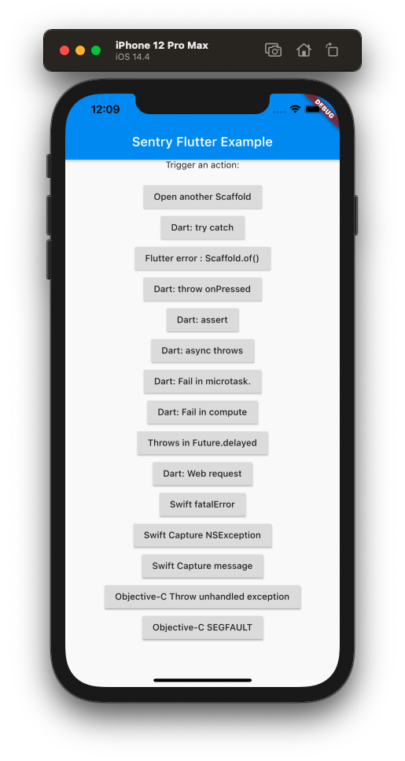
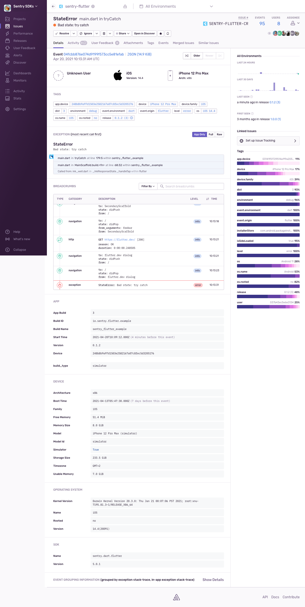

  
   

Sentry Example for Flutter
===========

This is a Flutter app that crashes intentionally in various ways. It demonstrates
how to capture errors and report them to [sentry.io](https://sentry.io/). 

# Running this sample

> First modify the `main.dart` and add your own DSN. You can get one at
> [sentry.io](https://sentry.io/). This will make sure you can see the result of
> running this app by looking at what this creates in Sentry.

You need to install [Flutter](https://flutter.dev/docs/get-started/install) in
order to run this sample. Once you have Flutter installed you can run it via
`flutter run`.

You should see something like this:

If you click in order on `Open another scaffold`, `Dart: web request` and 
`Dart: try catch`, you should see the following image on
[sentry.io](https://sentry.io/).

Note the event shows only the application frames by default. You can click
on the `Full` button to see the complete stack trace. There's also a list of breadcrumbs for
that exception. In order to get HTTP and navigational breadcrumbs you need to
use
[`SentryHttpClient`](https://docs.sentry.io/platforms/dart/usage/advanced-usage/#automatic-breadcrumbs)
and the
[`SentryNavigatorObserver`](https://docs.sentry.io/platforms/flutter/enriching-events/breadcrumbs/#automatic-breadcrumbs).

