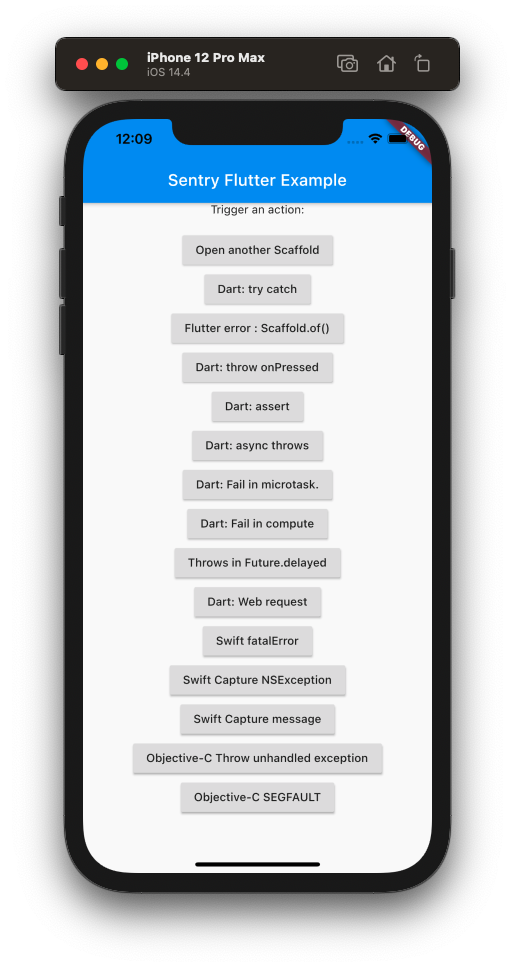
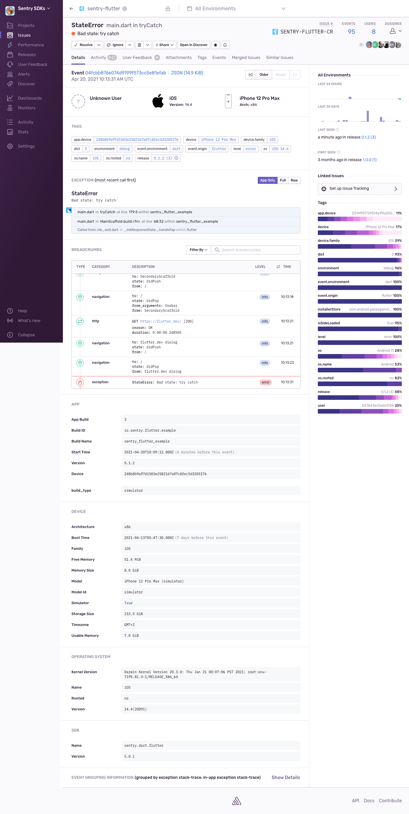

  
   

Sentry Example for Flutter
===========

This is a Flutter app that crashes intentionally in various ways. It demonstrates
how to capture errors and report them to [sentry.io](https://sentry.io/). 

# Running this sample

> First modify the `main.dart` and add your own DSN. You can get one at
> [sentry.io](https://sentry.io/). This will make sure you can see the result of
> running this app by looking at what this creates in Sentry.

You need to install [Flutter](https://flutter.dev/docs/get-started/install) in
order to run this sample. Once you have Flutter installed you can run it via
`flutter run`.

You should see something like this:

If you click in order on `Open another scaffold`, `Dart: web request` and 
`Dart: try catch`, you should see the following image on
[sentry.io](https://sentry.io/).

Note the event shows only the application frames by default. You can click
on the `Full` button to see the complete stack trace. There's also a list of breadcrumbs for
that exception. In order to get HTTP and navigational breadcrumbs you need to
use
[`SentryHttpClient`](https://docs.sentry.io/platforms/dart/usage/advanced-usage/#automatic-breadcrumbs)
and the
[`SentryNavigatorObserver`](https://docs.sentry.io/platforms/flutter/enriching-events/breadcrumbs/#automatic-breadcrumbs).

## App-start workloads

Configure the three booleans in `lib/app_config.dart`, then rebuild and
cold-launch with `flutter run --release`. All three default to **false**; enable
the phases you want to inspect:

- `prolongRootWidgetAttachment`: synchronously parses and filters sample catalog
  JSON in the root widget's `initState`, during root attachment.
- `prolongFrameBuild`: eagerly builds and lays out 1,800 catalog rows, including
  offscreen rows. When disabled, the sample catalog is omitted.
- `prolongFrameRasterization`: draws 18 blurred layers with very low, nonzero
  opacity. The effect is faint but still requires raster work.

The normal SDK home page remains the landing screen. An **App-start workloads**
section below the category cards shows the configuration. There are no runtime
switches or saved preferences. Its sample list is eagerly laid out during the
first frame even when below the viewport, and the faint raster effect is painted
across the home-page body. These workloads perform real work rather
than sleeping or fabricating timestamps. Durations depend on the device and
rendering backend; recording raster commands also costs framework paint time.

Hot reload and navigation do not create a new app-start trace. The existing
explicit startup extension remains separate from the measured phases.
Configure the Sentry project in `lib/app_config.dart`.
